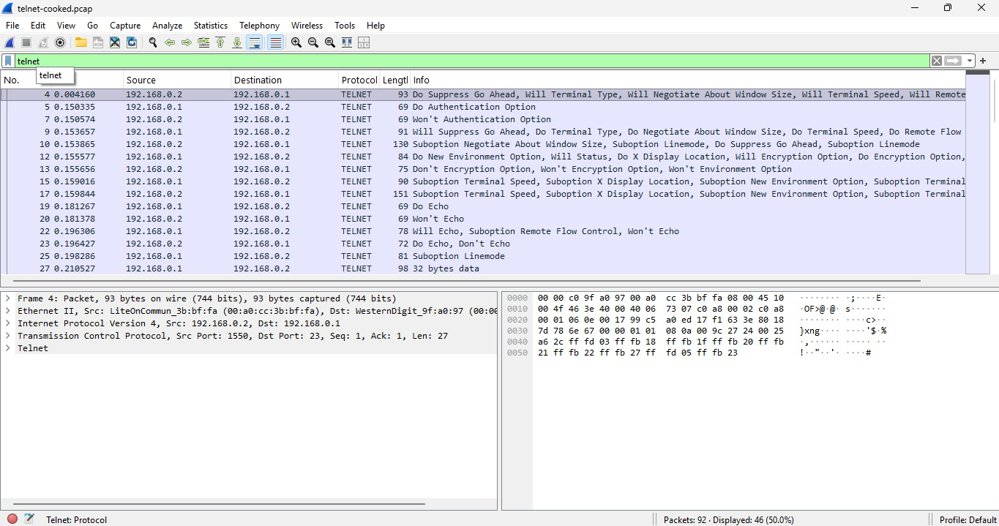
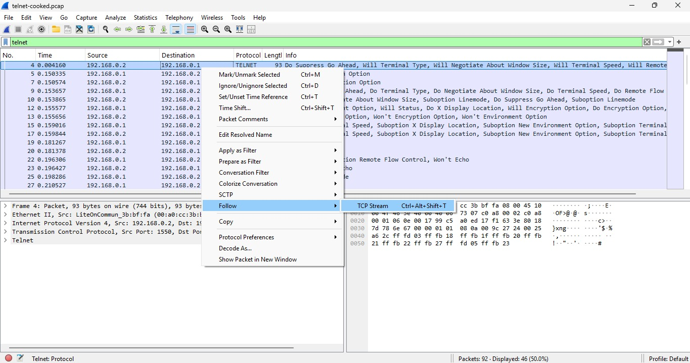
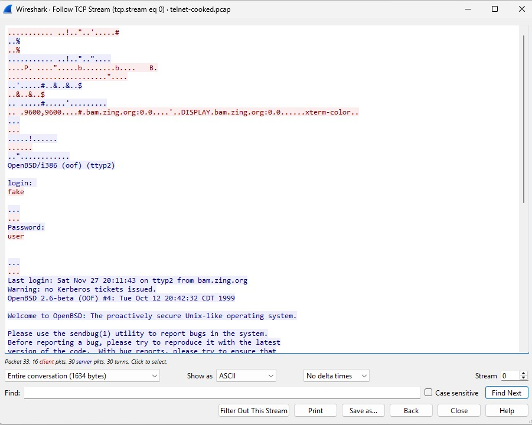
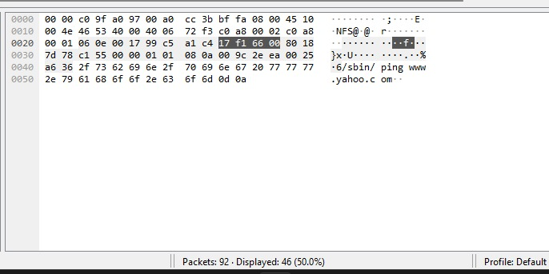
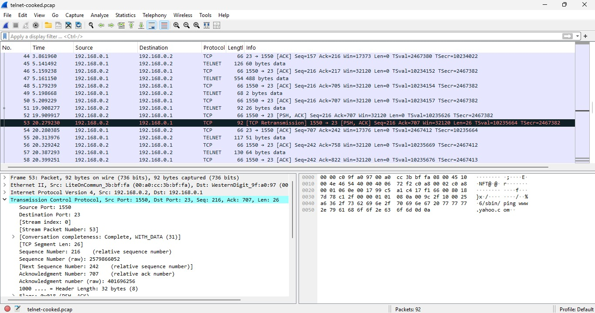

# Project 1: Telnet Network Forensic Analysis

## 1. Executive Summary
This project demonstrates the security risks of using unencrypted protocols. By capturing and analyzing Telnet (Port 23) traffic, I successfully extracted user credentials and identified network anomalies.

---

## 2. Traffic Identification & Method
I isolated Telnet traffic to observe the handshake between the client (`192.168.0.2`) and the server (`192.168.0.1`). To view the full dialogue, I utilized the **Follow TCP Stream** feature.

---

## 3. Credential Extraction (The "Smoking Gun")
By reconstructing the session, I revealed the plaintext login and password. This proves that any attacker with access to the network tap can harvest credentials without needing to crack encryption.

* **Username:** fake
* **Password:** user

---

## 4. Data Integrity & Hex Analysis
I verified the raw data by correlating the ASCII character **'f'** to its Hexadecimal value **'66'**. This level of analysis ensures that the captured data hasn't been tampered with and confirms the character encoding used by the terminal.

---

## 5. Anomaly Detection
The capture revealed **Malformed Packets** (highlighted in red/black). In a security context, these can indicate protocol instability or an attempt to exploit a service through malformed data injection.

---

## 6. Mitigation Recommendations
* **Disable Telnet:** Transition all remote management to **SSH (Port 22)**.
* **Encryption:** Implement TLS/SSL for all data in transit to prevent credential harvesting.
